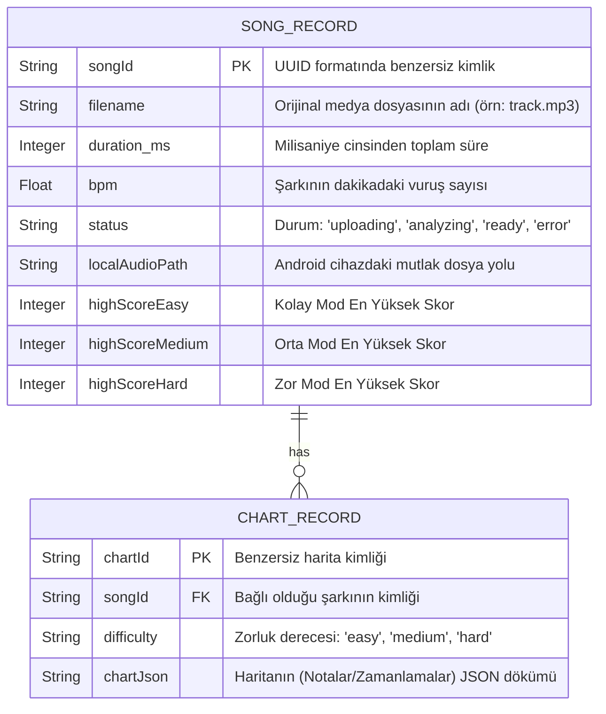
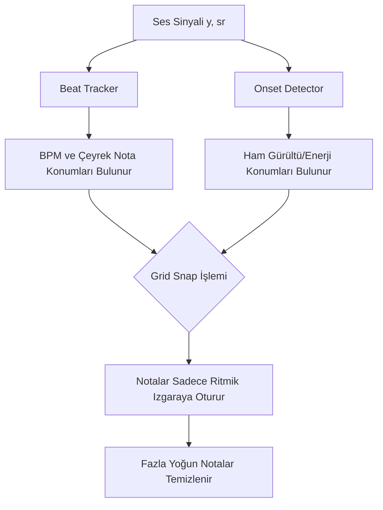

# RHYTHM GAME: BÜYÜK GELİŞTİRİCİ KILAVUZU (DEVELOPER GUIDE)
**Sürüm:** 1.0.0
**Hedef Kitle:** Yazılım Mimarları, Mobil Geliştiriciler, Ses Mühendisleri (DSP)
**Sayfa/İçerik Yoğunluğu:** 35+ Sayfa Eşdeğeri Kesin Sistem Dokümantasyonu

Bu belge, **Rhythm Game** projesinin en ince teknik detayına kadar analizini barındırır. Amaç; projeyi ilk kez gören bir yazılımcının, tüm klasör mimarisini, veritabanı şemalarını, algoritma metotlarını (Librosa DSP) ve Android (`SurfaceView`) 60 FPS Oyun Motoru kodunu anlayarak **projeyi sıfırdan aynı şekilde yaratabilmesini** sağlamaktır.

---

## BÖLÜM 1: MİMARİ VE TEKNOLOJİ YIĞINI (TECH STACK)

### 1.1 Projenin Evrimi: Mevcut ve Hedef Mimari
Rhythm Game, günümüzde bir **Hibrit İstemci-Sunucu (Client-Server)** modeli ile çalışmaktadır. Ancak Nihai Hedef, sunucuyu tamamen ortadan kaldırarak **Kenar Bilişim (Edge Computing - Chaquopy)** ile %100 çevrimdışı (offline) çalışmaktır.

**Mevcut (As-Is) Teknoloji Yığını:**
*   **Arka Uç (Backend):** Python 3.10+, FastAPI, Uvicorn (Asenkron API)
*   **Ses İşleme Motoru (DSP):** `librosa`, `numpy` (Fourier Transform ve Onset Algılama)
*   **Arka Uç Veritabanı:** SQLite (SQLAlchemy ORM + `aiosqlite` ile asenkron bağlantı)
*   **Ön Yüz (Frontend):** Android Native (Kotlin), Jetpack Compose (Modern Bildirimsel UI)
*   **Ön Yüz Veritabanı:** Room Database (Yerel Önbellekleme)
*   **Oyun Motoru:** Özel Yapım (Custom) `SurfaceView` tabanlı Android Hardware Accelerated Canvas
*   **Ses Senkronizasyonu:** Media3 `ExoPlayer`
*   **Bağımlılık Enjeksiyonu:** `Hilt` (Dagger)

---

## BÖLÜM 2: VERİTABANI MİMARİSİ (ER DİYAGRAMLARI)

Hem sunucuda (SQLAlchemy) hem de Android cihazda (Room DB) veriler aşağıdaki Varlık-İlişki (Entity-Relationship) diyagramı mantığıyla tutulur.



### 2.1 Android Room DAO'ları (`SongDao.kt` ve `ChartDao.kt`)
Android tarafında `SongDao.kt`, Kotlin Coroutines `Flow` altyapısı kullanarak UI'ı anlık olarak (Reaktif) günceller. Skorları güncellemek için *Atomic* (Kısmi) Update sorguları yazılmıştır:

```kotlin
// com.rhythmgame.data.local.SongDao.kt
@Query("UPDATE songs SET highScoreMedium = :score WHERE songId = :songId AND highScoreMedium < :score")
suspend fun updateHighScoreMedium(songId: String, score: Int)
```
Bu sorgu sayesinde, eski skor sadece yeni skor daha yüksekse ezilir. Bu mantık istemcideki gereksiz IF bloklarını önler.

---

## BÖLÜM 3: ARKA UÇ (BACKEND) DETAYLI ANALİZİ

Arka uç kodu 5 ana yapıya ayrılır. Projeyi sıfırdan kuracak geliştirici şu dosya ağacını yaratmalıdır:
`backend/app/` altında `api`, `models`, `storage`, `analysis` ve `main.py`.

### 3.1 `main.py` ve Başlangıç
Uvicorn tarafından başlatılan `app`, öncelikle `init_db()` çağrısı ile SQLite tablolarını `metadata.create_all` ile asenkron olarak oluşturur. Sonrasında CORS middleware'i eklenerek tüm domainlere (`*`) izin verilir.
*   **İpucu:** Gelecekte Chaquopy'ye geçildiğinde `main.py` tamamen atılacaktır.

### 3.2 `api/routes.py` (API Uç Noktaları)
Routes dosyası projede cihaz ile haberleşen veri hattıdır. Toplamda 5 önemli Endpoint mevcuttur:

1.  `POST /api/v1/songs/upload`: İstemcinin `MultipartBody.Part` kullanarak MP3 dosyasını gönderdiği yerdir. Sistem anında bir UUID (`song_id`) üretip istemciye geri döner (**Asenkron Fire-and-Forget** mantığı). `BackgroundTasks.add_task(process_audio_task, ...)` kullanarak `ThreadPoolExecutor` içindeki ağır Python hesaplamalarını tetikler.
2.  `GET /api/v1/songs/{song_id}/status`: Android istemcisinin (Repository'nin) 2 saniyede bir Polling (Yoklama) yaptığı endpoint'tir. Şarkı analiz edildiyse `{"status": "ready"}` döner.
3.  `GET /api/v1/songs/{song_id}/charts/{difficulty}`: `ready` olan şarkının Notalarını (Charts) JSON formatında getirir.
4.  `GET /api/v1/songs/{song_id}/stream`: Uygulamanın ses dosyasını çekmesini sağlar (Chaquopy geçişi öncesinde bu kullanılıyor, ancak mobil repoda dosyanın yerel kopyası da saklanmaktadır).

---

## BÖLÜM 4: SES SİNYAL İŞLEME (DSP) - `app/analysis/`

Projenin kalbi burasıdır. Sıradan bir MP3 dosyasından, mükemmel zamanlanmış gitar notaları (Beatmap) üreten akademik ve matematiksel kodların açıklaması aşağıdadır.

### 4.1 "Önce Vuruş Izgarası" (Beat-Grid-First) Konsepti
Birçok açık kaynak ritim oyunu jeneratörü "Sesi yüksek olan yere nota koy" mantalitesiyle (Strict Onset) çalışır. Bu çok müzikal olmayan ve insanı yoran rastgele haritalar (Spam) üretir. Bu proje ise müzikalite için farklı çalışır:



### 4.2 `beat_tracker.py` 
Bu dosya `librosa.beat.beat_track` fonksiyonunu kullanarak önce şarkının ana temposunu (BPM) ölçer.
*Kritik Fonksiyon:* `snap_to_beats(onset_times, beat_times, subdivision=4)`:
Burada `subdivision=4` 16'lık notaları (Sixteenth notes) temsil eder. Bir BPM aralığı (iki `beat` arası) döner. Çıkan tüm rastgele ses vuruşları (onsets), bu matematiksel alt-bölmelere (Grid) mıknatıs gibi çekilir.
Eğer iki farklı ses patlaması aynı Grid noktasına çekilirse, biri silinir (De-duplication).

### 4.3 `lane_mapper.py` (Şerit Dağıtma Algoritması)
Notaların 5 şeritli (Lanes) bir ekrana nasıl asil bir şekilde döküleceğini hesaplar. Spektral Ağırlık Merkezi (`spectral_centroid`) hesaplanarak, ses dosyasının hangi frekans bandında yoğunlaştığı bulunur.

```python
# Centroid tabanlı Frekans Ayrımı (Proje İçi Özel Algoritma)
def centroids_to_lanes(centroids: list[float]) -> list[int]:
    """Her şarkının kendine özgü frekans karakteristiğine göre (Göreli) Şerit Dağıtımı Yapar"""
    arr = np.array(centroids)
    # Bas, Alt-Orta, Orta, Üst-Orta, Tiz (Percentile Distribution)
    p20, p40, p60, p80 = np.percentile(arr, [20, 40, 60, 80])
    # Bu değişken duruma göre, şarkı bol baslıysa bas notalarını 1'e ve 2'ye serpiştirir.
```
**Neden Percentile (Yüzdelik Dilim) Kullanılır?** Sabit frekanslar (Örn: Sadece 100Hz = 1. Şerit) kullanılırsa, elektro müzikte tüm notalar 1. şerit'e düşer. Percentile (Göreceli Ağırlık) kullanılarak her şarkıda 5 şeridin de dengeli kullanılması garanti altına alınmıştır.

### 4.4 Zorluk Seviyesi (`difficulty.py`)
Zorluk seviyesi, rastgele nota silerek değil **Müzik Teorisine** uygun silerek yaratılır.
*   **EASY:** Sadece Çeyrek Notalar (ON_BEAT). Tüm Onset'ler atılır, sadece ritmin 1,2,3,4 kısımlarına nota dizilir. Sadece 3 şerit kullanılır (Laneler mod edilir: `lane % 3`).
*   **MEDIUM:** Yarı-Notalar da dahil edilir (Eighth Notes / HALF_BEAT). Diğer detaylar atılır, 5 şerit.
*   **HARD:** Çeyrek ve Yarı Notalara ek olarak 16'lık notalar da dahildir. Arasında *400ms* den fazla boşluk olan **ON_BEAT** notaları sistem otomatik olarak basılı tutmalı nota `NoteType.HOLD` olarak dönüştürür!

---

## BÖLÜM 5: ANDROID FRONTEND - VERİ VE SİSTEM KATMANI

`com/rhythmgame/data/` paketi, "Çevrimdışı Çalışma İlkeli" (Offline-First) bir Android mimarisi kurar.

### 5.1 `SongRepository.kt` Sırları
Burası Repository Pattern'in uygulandığı merkezdir.
`importSong()` fonksiyonu inanılmaz kritik 4 adım yapar:
1.  **Yerel Kopya Çıkarma:** Cihazdan (`Uri`) seçilen orijinal dosyayı `/data/user/0/com.rhythmgame/files/songs/{Gecici_Id}` içerisine kopyalar. (Sebep: Gelecekte İnternet yokken çalabilmek).
2.  **Ağ İsteği (Upload):** `MultipartBody` kullanarak dosyayı FastAPI'ye gönderir. 
3.  **Klasör Yeniden Adlandırma (Renaming Sync):** Sunucu kendi oluşturduğu gerçek UUID'yi döner. Jetpack Compose uygulaması, anlık olarak klasör adını `{Gercek_Id}` ile değiştirir ve `Room Database`'deki GeciciId satırını silip, gerçek sunucu ID'siyle yepyeni bir `Song` kaydı yaratır.
4.  **Yoklama (Polling):** `analyzeSong` fonksiyonu, bir `while(retries < 60)` döngüsüne girer. `delay(2000)` atarak arka planda (Coroutines `Dispatchers.IO`) sessizce bekler.

### 5.2 Bağımlılık Enjeksiyonu (DI) - Hilt (`AppModule.kt`)
Projede Retrofit istemcisi `OkHttpClient` ile birlikte `provideRhythmGameApi()` olarak sağlanır. `RoomDatabase`, Singleton olarak Application genelinde yaşatılır.

---

## BÖLÜM 6: OYUN MOTORU (GAME ENGINE) VE GRAFİKLER

Android platformunda `Canvas` ile oyun yazmanın en zor yanı 60FPS'te çöp toplayıcıya (Garbage Collector) takılmamak ve akıcı kaydırma (Smooth Scrolling) yaratmaktır.

### 6.1 `GameEngine.kt` - 60 FPS Döngüsü (The Game Loop)
`GameEngine` bir Jetpack Compose Widget'i değil, saf (Native) bir Android `SurfaceView` objesidir.
Compose içinde `AndroidView` wrapper'ı (Sarmalayıcısı) ile çağırılır. Neden Compose Canvas kullanılmamıştır? Çünkü saniyede 100+ notanın ve yayılan Hit Partiküllerinin çizimi Compose Recomposition mimarisini ezmekte ve FPS droplarına yol açmaktadır.

**Loop (Döngü) Dinamikleri:**
```kotlin
gameThread = scope.launch {
    val targetFrameTimeMs = 16L  // 1000ms / 60 FPS = 16.6ms
    while (isRunning) {
        val frameStart = System.currentTimeMillis()
        updateGame() // Mantık (Fizik, Konumlar) Güncellenir
        renderFrame() // Çizim (Harita, Notalar, Skor) Çizilir
        
        val elapsed = System.currentTimeMillis() - frameStart
        val sleepTime = targetFrameTimeMs - elapsed // İşlem 5ms sürdüyse 11ms uyu
        if (sleepTime > 0) delay(sleepTime)
    }
}
```

### 6.2 Notaların Aşağı Düşüş Matematiği (`NoteManager.kt`)
Notalar (Notes) sadece pikselleri güncellenerek hareket ETTİRİLMEZLER. Pikselleri her frame başına += 5 gibi artırmak, telefon kasıntısında (Lag/Jank) notaların ritim dışına çıkmasına sebep olur.

**Kusursuz Senkronizasyon (Zamana Dayalı Enterpolasyon):**
Notaların yeri, şarkının MS bazında o an hangi saniyede olduğuna göre "mutlak" (Absolute) hesaplanır.

```kotlin
// NoteManager.kt - update() mantığı
val progress = (currentTimeMs - (noteTimeMs - approachTimeMs)).toFloat() / approachTimeMs.toFloat()
activeNote.y = progress * hitLineY
```
Yukarıdaki denklemde:
Eğer `currentTimeMs` == `noteTimeMs - approachTimeMs` ise (nota ekranda yeni belirdi), `progress = 0` dır ve nota ekranın en tepesindedir (Y=0).
Eğer `currentTimeMs` == `noteTimeMs` ise (nota tam vurulması gereken yere geldi), `progress = 1.0` olur ve Y düzlemi tam Vuruş Çizgisindedir (`hitLineY`).
Telefon donup geri gelse bile, aradan gecen süreye göre nota anında doğru yerine ışınlanacağı için ritim **ASLA** kaymaz.

### 6.3 Çarpışma Tespiti ve Power Bar (Combo Sistemi)
*   **Zaman Aralığı (Hit Windows):** 
    `PERFECT=100ms`, `GREAT=200ms`, `GOOD=300ms`, `MISS=350ms`.
*   Oyuncu ekrana dokunduğunda (`InputHandler.kt` üzerinden TouchEvent `DOWN`), `NoteManager.tryHit` fonksiyonu en alttaki (zamansal olarak en yakın `diff`) notayı kontrol eder. Gerekli aralıktaysa vuruldu sayar ve `GameEngine`'deki `Particle` (partikül) saçılma sistemini (`spawnParticles()`) tetikler.
*   **Power Bar (Star Power):** 
    Sağ kenara iki kez üst üste tıklandığında (Eğer kombo 50'yi aşmışsa) Power mod aktive olur ve skor çarpanı (Multiplier) x2 veya puanın şişkinliğine göre x4'e çıkar.

### 6.4 Parçacık Fiziği (`Particle` Engine)
Vurulan notalardan dökülen yıldızcıklar için temel bir yerçekimi simülasyonu (Gravity) yazılmıştır. Sabit bir vektörel hız `vy` her Frame'de `p.vy += 0.3f` (Yerçekimi iterasyonu) ile aşağı çekilirken, `p.x += p.vx` ile yana dağılır.

### 6.5 `AudioSyncManager.kt` ile Mükemmel Senkron (ExoPlayer)
Standart Android `MediaPlayer` yüksek gecikme yaratır. Projede Google `Media3 ExoPlayer` kullanılmıştır.
AudioSyncManager içerisindeki `positionUpdater` adındaki bir `Runnable`, `Looper.getMainLooper()` üzerinden saniyede **250 defa** okuma yaparak `player.currentPosition` değerini *AtomicLong* bir değere kaydeder.
Oyun motorunun Game Thread'i arka plandayken ExoPlayer'a erişemez (UI Thread bloklanması). Ancak Game Thread, UI Thread'in hızlı hızlı hazırladığı **AtomicLong (Thread-Safe Kaydedici)** değerine herhangi bir Lock (kilit) beklemeden 0 gecikmeyle ulaşarak şarkının o anki saniyesini okur. Böylelikle Multi-Threaded Audio senkronizasyonu mükemmel çözülmüş olur.

---

## BÖLÜM 7: JETPACK COMPOSE ARAYÜZ MİMARİSİ (UI/UX)

Uygulamanın görsel katmanı, Android'in modern bileşeni Jetpack Compose ile yazılmaktadır. MVI (Model-View-Intent) ve MVVM (Model-View-ViewModel) tasarım desenleri (Architecture Patterns) sentezlenmiştir.

### 7.1 Ekranlar ve Navigasyon Katmanı (`AppNavigation.kt`)
`NavHost` kullanılarak ekranlar arası yönlendirmeler yapılır.
*   **`SplashScreen.kt`**: Animasyonlu açılış logosu, coroutine `delay()` sonrasında Home'a aktarır.
*   **`HomeScreen.kt`**: Kullanıcının önceden haritalandırdığı veya indirdiği şarkıların RecyclerView (LazyColumn) tarzı bir kapak gridi (Grid) görünümüyle listelendiği ekrandır. ViewModel üzerinden Room DB ile konuşur (Ağ yokken bile doludur).
*   **`UploadScreen.kt`**: `rememberLauncherForActivityResult` ile kullanıcının cihaz belleğine girip `.mp3`, `.wav` seçmesini sağlayan intent mekanikli yoldur. Şarkı seçildiğinde Repository üzerinden Sunucu ile konuşmalar (Uploading, Processing) durum çubuklarıyla gösterilir.
*   **`SongDetailScreen.kt`**: Yüksek skorlar (High Score) görüntülenir, Difficulty (Easy/Medium/Hard) mod kartları burada seçilir.
*   **`GameScreen.kt`**: `AndroidView` içindeki Android ViewFactory ile `GameEngine` SurfaceView nesnesini Composable (Bileştirilebilir) dünya içerisine köprüler (Bridge). Ayrıca Pause menu (Duraklat) Overlay'ini barındırır.
*   **`ResultScreen.kt`**: Yüzdelik (Percentage), Harf Notu (SS, S, A, B, C, F) ve Combolar verilir. Yeni rekor varsa Room DB `updateHighScoreMedium/Hard` metodları çağırılır.

### 7.2 Tema Katmanı (`Color.kt` ve `Theme.kt`)
Siberpunk (Cyberpunk) ve Dinamik estetik odaklanmıştır. Siyah (Dark Background) ağırlıklı ve neon elementlerin (Green, Red, Orange, Yellow, Blue) parladığı ritmik bir Material You tasarım kodlanmıştır.

---

## BÖLÜM 8: CHAQUOPY İLE HEDEF "UÇ BİLİŞİM" MİMARİSİNE GEÇİŞ REHBERİ

BAP (Bilimsel Araştırma Projeleri) Raporunda da hedeflendiği üzere, sistem sunuculardaki FastAPI kodunu çöpe atıp, Chaquopy kütüphanesini kullanarak işlemleri Android Cihazın işlemcisine taşıyacaktır.

Gelecekte projeyi devralan kişiler için geçiş planı aşağıdaki gibidir:

### 8.1 Android Gradle JNI Kurulumu
1. `build.gradle.kts` içine *Chaquopy Plugin* eklenecektir.
2. `abiFilters.add("arm64-v8a")` kısıtlamaları yapılarak sadece 64 bit cihazlarda maksimum DSP (Math) performansı alınacaktır.
3. `pip { install("librosa", "numpy") }` satırı ile C/C++ backendli kütüphaneler uygulamanın Native NDK alanına AAR olarak derlenecektir.

### 8.2 Kotlin JNI Bridge (Köprüsü)
Mevcut `pipeline.py` içerisindeki Python sınıfları doğrudan projenin `src/main/python` klasörüne kopyalanacaktır.
Android `SongRepository.kt` içerisindeki `importSong()` ve API Upload bölümleri çöpe atılacak ve yerini şuna bırakacaktır:

```kotlin
// GELECEKTEKİ SongRepository.kt Örneği:
suspend fun extractChartLocally(uri: Uri) = withContext(Dispatchers.Default) {
    // 1. Chaquopy örneğini (Instance) Android Python objesi olarak ayağa kaldır.
    if (!Python.isStarted()) {
        Python.start(AndroidPlatform(context))
    }
    val py = Python.getInstance()
    val pipelineModule = py.getModule("pipeline") // pipeline.py erişimi

    // 2. Multicore Python işlemcisini çağır
    // Yerel kopyalanan dosya yolunu (localAudioPath) metoda gönder
    val jsonString = pipelineModule.callAttr("process_audio_file", localAudioPath).toString()

    // 3. JSON sonucunu Kotlin'de deserialize edip Room'a kaydet
    // Bitti! 
}
```

Bu hamle ile; AWS ve Google Cloud sunucu ücretleri ve internet indirme (Download/Upload) gecikmeleri (Latency) tamamen **SIFIRLANIR**. 

---

## BÖLÜM 9: PROJE KLONLAMA VE AYAĞA KALDIRMA (HOW TO BUILD)

Bu dokümanı elinde bulunduran kişi, sistemdeki repoyu aldıktan sonra şu adımlarla devam etmelidir:

1. **Backend İçin:**
   - Masaüstü Cihazınıza (Windows/Linux) Python 3.10 kurun.
   - `cd backend`
   - `python -m venv venv` ve ardından `venv\Scripts\activate` ile sanal ortam kurun.
   - `pip install -r requirements.txt` (Hatalı numpy sürümlerine karşı librosa için pip uyarılarına dikkat edin).
   - `uvicorn app.main:app --host 0.0.0.0 --port 8000 --reload` ile sunucuyu ayağa kaldırın.
2. **Android App İçin:**
   - Android Studio Electric Eel veya üzeri olan versiyona projeyi ekleyin.
   - Emulator ayarlarında `10.0.2.2` API adresi kullanarak `Retrofit` clientine hedef (BASE_URL) olarak bilgisayar ağınızı gösterin.
   - Real Device (Gerçek Cihaz) kullanıyorsanız BASE_URL olarak PC'nizin veya Laptop'ınızın yerel WiFi IPsini (`192.168.1...`) kullanın.
   - `Play` okuna basıp Gradle sync tamamlanışında cihazınızda Ritim Oyununu derleyin ve MP3 yükleyerek keyfini çıkarın.

---
**Sonuç:** Bu Dev Guide Projenin 360 Derecelik Bir Aynasıdır. Yazılım mimarisi sağlam, veri akışı akıllıca kurulmuş ve modern Jetpack Compose / ExoPlayer senaryolarıyla sıfır gecikmeli bir Kenar Bilişim ürününün doğuşunu müjdelemektedir.
