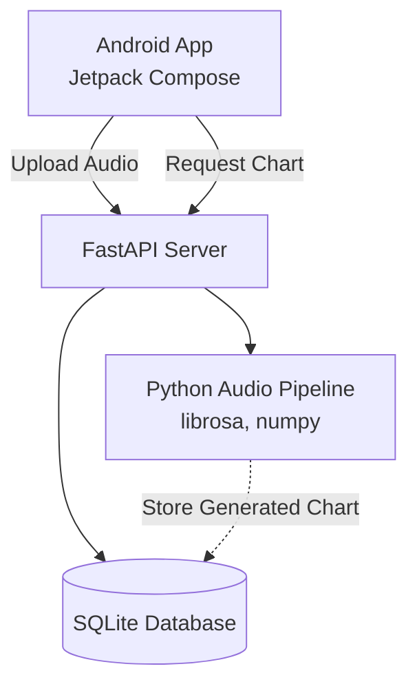
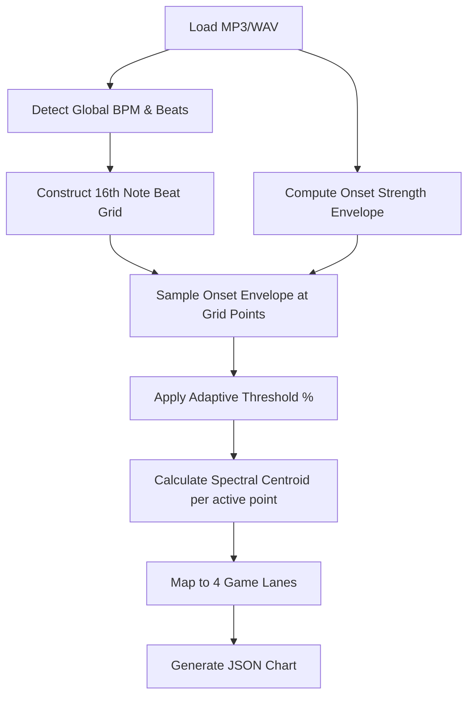
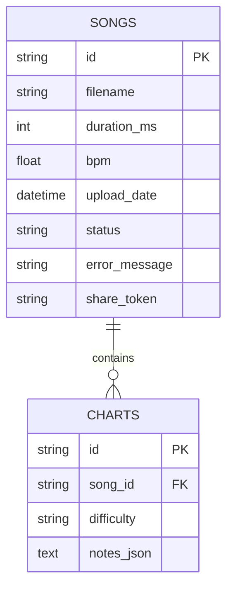
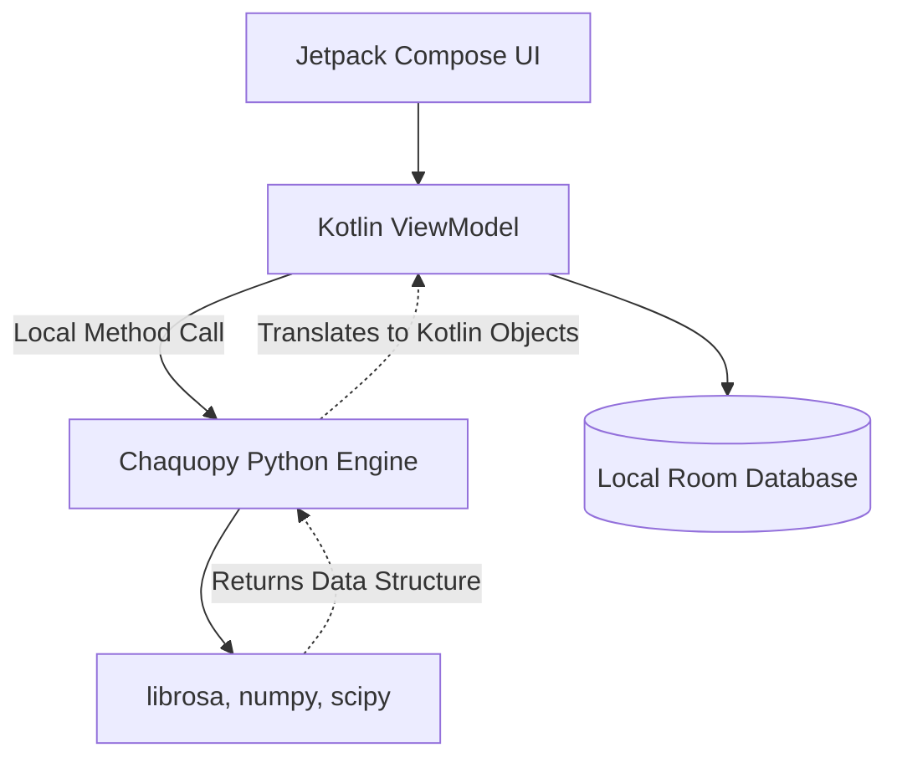

# Rhythm Game Project - Comprehensive Technical Documentation

## Table of Contents
1. [Executive Summary and Project Overview](#1-executive-summary-and-project-overview)
2. [Current Architecture and System Design](#2-current-architecture-and-system-design)
3. [Backend Implementation (FastAPI)](#3-backend-implementation-fastapi)
4. [Audio Analysis and Processing Pipeline](#4-audio-analysis-and-processing-pipeline)
5. [Android Frontend Application (Jetpack Compose)](#5-android-frontend-application-jetpack-compose)
6. [Data Models and Database Schema](#6-data-models-and-database-schema)
7. [Chaquopy Migration Plan: Moving to a Fully Local Architecture](#7-chaquopy-migration-plan-moving-to-a-fully-local-architecture)
8. [Deployment and Building the App](#8-deployment-and-building-the-app)
9. [Conclusion and Future Roadmap](#9-conclusion-and-future-roadmap)

---

## 1. Executive Summary and Project Overview

### 1.1 Introduction
The Rhythm Game project is an innovative mobile application designed to analyze user-uploaded audio files (e.g., MP3, WAV) and automatically generate playable rhythm game beatmaps or "charts." Unlike traditional rhythm games that rely on pre-mapped levels, this application uses advanced audio signal processing techniques—incorporating beat tracking, spectral centroid analysis, and onset detection—to dynamically create engaging gameplay synced perfectly to the music.

### 1.2 Core Objectives
- **Automated Chart Generation:** To eliminate manual beatmapping by using algorithms to detect rhythm and musical intensity.
- **Cross-Platform Accessibility:** Currently utilizing a decoupled architecture with a Python backend and an Android frontend.
- **On-Device Migration:** To transition the heavy backend processing directly onto the Android device using `Chaquopy`, eliminating the need for an active internet connection or expensive server hosting.

---

## 2. Current Architecture and System Design

The existing architecture is a classic Client-Server model.

### 2.1 High-Level Architecture Diagram


### 2.2 Component Breakdown
- **Frontend Container:** The Android application built with Jetpack Compose. It handles user interactions, media playback via ExoPlayer, and renders the falling notes in the rhythm game interface.
- **Backend Container:** A Python-based FastAPI web server. It exposes RESTful endpoints for the app to communicate with.
- **Audio Processing Engine:** The core mathematical and DSP (Digital Signal Processing) component leveraging the `librosa` library.
- **Storage Layer:** SQLite database accessed asynchronously via SQLAlchemy. It stores metadata about uploaded songs, their processing status, and the serialized JSON string of the gameplay charts.

---

## 3. Backend Implementation (FastAPI)

The backend serves as the orchestration layer between the user's intent (uploading a song) and the heavy lifting of audio analysis.

### 3.1 API Routes Definition
The application uses modern asynchronous Python with FastAPI. The routing logic is modularized in `app/api/routes.py`.

#### `POST /api/upload`
Accepts an audio file upload. It saves the file locally and kicks off a background thread via `ThreadPoolExecutor` to process the audio, immediately returning a `processing` status.
```python
@router.post("/upload", response_model=UploadResponse)
async def upload_song(file: UploadFile = File(...), session: AsyncSession = Depends(get_session)):
    # File validation and saving...
    # Run analysis in background
    asyncio.get_event_loop().run_in_executor(
        executor, _run_analysis_sync, song_id, filename, upload_path
    )
    return UploadResponse(song_id=song_id, status="processing", message="File uploaded.")
```

#### `GET /api/chart/{song_id}`
Retrieves the finalized note chart for a specific difficulty level. It checks the song's status in the database prior to responding.

### 3.2 Concurrency Model
Audio analysis is heavily CPU-bound. Python's Global Interpreter Lock (GIL) can block asynchronous web requests if audio processing is done on the main thread. Therefore, the application uses a `ThreadPoolExecutor` to run the CPU-heavy Librosa tasks offline, periodically updating the SQLite database with the progress status (`PROCESSING`, `READY`, `ERROR`).

---

## 4. Audio Analysis and Processing Pipeline

The most critical component of the application resides in `app/analysis/pipeline.py`. The algorithm uses a "beat-grid-first" approach rather than naive onset snapping.

### 4.1 Pipeline Workflow


### 4.2 Core Logic Deep Dive
Instead of finding peaks in the audio and forcing them to the nearest musical beat, the pipeline *generates* the musical beats first, then checks if there is audio energy precisely at those structural points.

```python
def analyze_audio(input_path: str, wav_path: str, song_id: str, filename: str) -> dict:
    # ... loading audio ...
    bpm, beat_times = detect_tempo_and_beats(y, sr)
    
    # Grid construction (Quarter, Eighth, Sixteenth notes)
    grid_times, grid_positions = _build_beat_grid(beat_times)
    
    # Energy detection
    onset_env = librosa.onset.onset_strength(y=y, sr=sr)
    grid_strengths = _sample_strength_at_grid(grid_times, onset_env, onset_sr)
    
    # ... adaptive thresholding and lane mapping ...
```
By mapping the Spectral Centroid (the "center of mass" of the frequency spectrum) to specific lanes, deeper instruments like kick drums map to left lanes, while high-hats and snares map to right lanes.

---

## 5. Android Frontend Application (Jetpack Compose)

The client application is built entirely in Kotlin using Jetpack Compose, emphasizing a reactive UI paradigm.

### 5.1 Architecture (MVVM)
The app follows the Model-View-ViewModel architecture.
- **View:** Composable functions mapping state to UI.
- **ViewModel:** Classes retaining state across configuration changes, calling Repositories.
- **Repository:** Network (Retrofit) and local database (Room) abstractions.
- **DI:** Dependency Injection is handled via Hilt (`@HiltAndroidApp`).

### 5.2 Key Dependencies
- `androidx.compose.ui`: Modern UI toolkit.
- `com.squareup.retrofit2`: Networking for communicating with the current FastAPI backend.
- `androidx.media3:media3-exoplayer`: Highly optimized media player that plays the source audio simultaneously with the falling notes.
- `androidx.room`: Local caching for offline capabilities.

---

## 6. Data Models and Database Schema

The system uses SQLAlchemy 2.0 with the `aiosqlite` driver for async SQLite access.

### 6.1 Database Schema Diagram


### 6.2 Data Flow Example
When a Chart is generated, the `notes_json` column is populated with a serialized list of Note objects:
```json
{
  "song_id": "uuid-1234",
  "difficulty": "HARD",
  "notes": [
    {"time_ms": 1200, "lane": 0, "type": "TAP"},
    {"time_ms": 1600, "lane": 3, "type": "TAP"}
  ]
}
```

---

## 7. Chaquopy Migration Plan: Moving to a Fully Local Architecture

> [!WARNING]
> The current client-server design introduces latency, server hosting costs, and requires the user to have an active internet connection.

The overarching goal of the project is to migrate the Python FastAPI logic directly into the Android application using **Chaquopy**.

### 7.1 What is Chaquopy?
Chaquopy is a plugin for Android Studio's Gradle-based build system. It provides a seamless way to embed a Python interpreter inside an Android app, allowing Kotlin and Python code to interoperate natively via JNI.

### 7.2 Proposed Local Architecture


### 7.3 Migration Steps
1. **Gradle Configuration:** Modify `build.gradle.kts` to apply the `com.chaquo.python` plugin.
2. **Pip Requirements:** Define required Python packages (`librosa`, `numpy`) within the Android gradle file.
   ```kotlin
   python {
       pip {
           install("librosa")
           install("numpy")
       }
   }
   ```
3. **Refactor Pipeline:** Remove all network-related FastAPI code from the Python pipeline. Convert the `pipeline.py` script to accept a local generic file path provided by the Android MediaStore API, and have it return native Python dictionaries that Chaquopy will automatically marshal into `java.util.Map` objects in Kotlin.
4. **Offline Processing Integration:** Migrate the background threading. Replace FastAPI's `ThreadPoolExecutor` with Kotlin Coroutines (`Dispatchers.Default` for CPU-heavy tasks) calling the Chaquopy instance.

### 7.4 Expected Benefits
- **Zero Server Costs:** Audio analysis runs completely on the user's hardware.
- **Offline Playability:** Users can analyze downloaded MP3s without internet access.
- **Privacy:** User audio data never leaves the device.

---

## 8. Deployment and Building the App

To build the current application:
1. Ensure JDK 17+ is installed.
2. Run the FastAPI development server: `uvicorn main:app --host 0.0.0.0 --port 8000`
3. Update the Retrofit base URL in the Android app's DI module to point to the local machine's IP address.
4. Build the APK using `./gradlew assembleRelease` or run it directly on a device/emulator via Android Studio.

---

## 9. Conclusion and Future Roadmap

The Rhythm Game application demonstrates a highly sophisticated synthesis of signal processing and modern mobile game development. The transition from a web-based pipeline to an on-device embedded Python engine via Chaquopy represents the next monumental leap for the project, promising enhanced user experience, privacy, and architectural resilience. 

Subsequent phases of development will focus exclusively on optimizing the Python dependencies to run efficiently on ARM-based mobile processors to minimize battery drain and thermal throttling.
