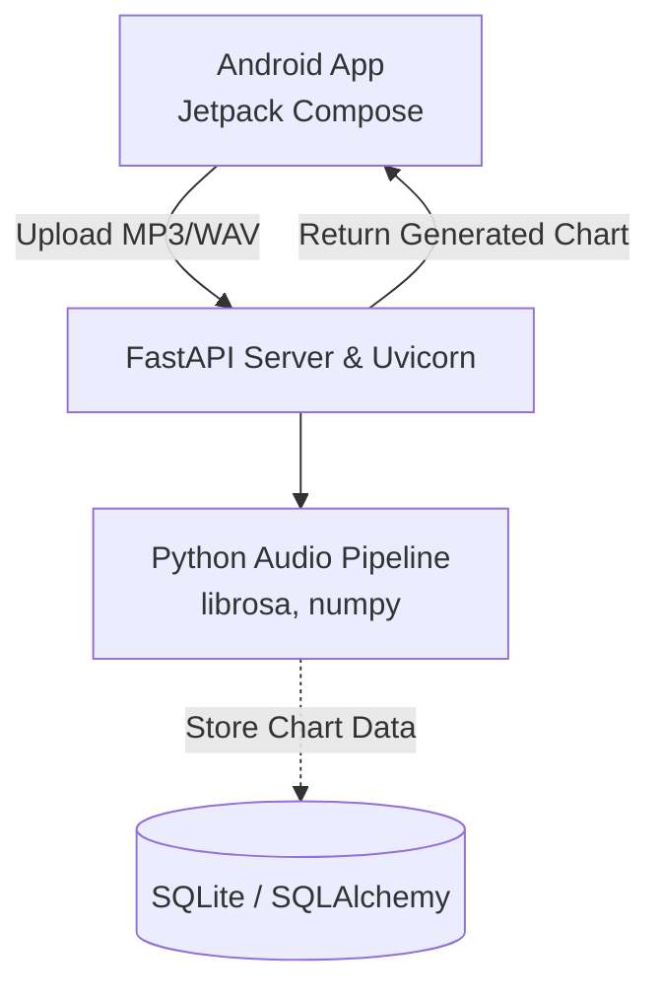
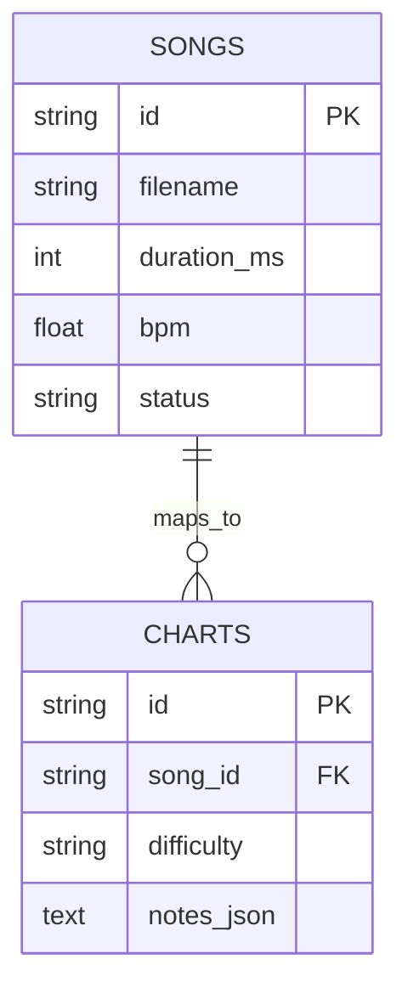

# Rhythm Game  
# Proje Raporu

## Vitrin Değil, Ritim Odaklı Eşleşme

---

## İçindekiler
1. [PROJENİN ADI](#1-projenin-adi)
2. [PROJENİN ÇIKIŞ NOKTASI VE GÜNCEL PROBLEM](#2-projenin-çikiş-noktasi-ve-güncel-problem)
3. [PROJE ÖZETİ](#3-proje-özeti)
4. [PROJENİN AMACI VE HEDEFLERİ](#4-projenin-amaci-ve-hedefleri)
5. [LİTERATÜR ÖZETİ VE ÖZGÜNLÜĞÜ](#5-literatür-özeti-ve-özgünlüğü)
6. [YÖNTEM VE ARAŞTIRMA PLANI](#6-yöntem-ve-araştirma-plani)
7. [İŞ PLANI VE ZAMAN ÇİZELGESİ](#7-i̇ş-plani-ve-zaman-çi̇zelgesi̇)
8. [BÜTÇE BEKLENTİSİ VE GEREKÇESİ](#8-bütçe-beklenti̇si̇-ve-gerekçesi̇)
9. [BEKLENEN ÇIKTILAR VE YAYGIN ETKİ](#9-beklenen-çiktilar-ve-yaygin-etki̇)
10. [ARAŞTIRMA PROBLEMİ VE HİPOTEZLER](#10-araştirma-problemi̇-ve-hi̇potezler)
11. [RİSK ANALİZİ VE RİSK AZALTMA STRATEJİLERİ (B Planları)](#11-ri̇sk-anali̇zi̇-ve-ri̇sk-azaltma-strateji̇leri̇-b-planlari)
12. [PROJE SONUÇLARININ PAYLAŞIMI, YAYGIN ETKİ (DISSEMINATION) VE SÜRDÜRÜLEBİLİRLİK](#12-proje-sonuçlarinin-paylaşimi-yaygin-etki̇-dissemination-ve-sürdürülebi̇li̇rli̇k)
13. [KAYNAKLAR](#13-kaynaklar)

---

## 1. PROJENİN ADI 
"Rhythm Game: Cihaz Üzerinde Kenar Bilişim (Edge Computing) ve Python Algoritmaları ile Desteklenen, Dinamik Ses Analizli ve Sıfır Gecikmeli Yeni Nesil Müzik Oyunu"

**İngilizce:** "Rhythm Game: Development of a Next-Generation Music Game Synthesizing Dynamic Audio Analysis and Embedded Python Algorithms via Edge Computing for Zero-Latency Chart Generation"

## 2. PROJENİN ÇIKIŞ NOKTASI VE GÜNCEL PROBLEM

### 2.1 Müzik Oyunlarında Statik İçerik Darboğazı ve Sunucu Gecikmesi
Günümüz mobil oyun ekosisteminde müzik/ritim oyunları ("Osu!", "Beat Saber", vb.) milyonlarca kullanıcıya ulaşsa da, literatürde "İçerik Bağımlılığı Paradoksu" (Content Dependency Paradox) olarak adlandırılan yapısal bir tıkanıklık yaşanmaktadır. Oyuncular, yalnızca geliştiricilerin manuel olarak hazırladığı "haritalara" (beatmaps/charts) ve telif hakkı alınmış sınırlı şarkı havuzuna mahkumdur. Bu durum projeyi şekillendiren üç ana kriz noktasını doğurur:

*   **Manuel Haritalandırma (Charting) Yavaşlığı:** Mevcut oyunlarda bir şarkının notalarının müziğin ritmine senkronize edilmesi (charting) işlemi, "mapper" adı verilen topluluk gönüllüleri veya oyun tasarımcıları tarafından manuel olarak yapılmaktadır. Bu, yeni içerik üretimini inanılmaz derecede yavaşlatmaktadır.
*   **İnternet ve Sunucu Maliyeti (Cloud Processing):** Otomatik harita üretebilen modern uygulamalar, ses dosyasını uzak sunuculara (AWS, GCP) yükleyip orada analiz ettirmektedir. Bu hem sunucu tarafında devasa maliyetler "Bulut Vergisi" doğurmakta hem de kullanıcı tarafında internet bağlantısı zorunluluğu ve gecikme (latency) yaratmaktadır.
*   **Kişiselleştirme Eksikliği:** Kullanıcılar kendi yerel cihazlarındaki veya yeni indirdikleri favori müzikleri sisteme kolayca entegre edememektedir.

### 2.2 Mevcut Çözümlerin Yetersizliği
Rekabet analizi incelendiğinde, müzik oyunlarının yapısal olarak iki ayrı kutba sıkıştığı görülmektedir:

*   **Offline / Statik Oyunlar:** Sadece gömülü (hardcoded) şarkılarla çalışır. Yeni müzik eklemek imkânsızdır.
*   **Online / Otomatik Oyunlar:** Kullanıcının MP3 dosyasını sunucuya yüklemesini bekler. Çevrimdışıyken çalışmaz, yükleme süreleri can sıkıcıdır ve kullanıcı gizliliği (korsan müzik tespiti vs.) tehlikeye girer.

**Kritik boşluk:** Kullanıcıların kendi MP3 dosyalarını direkt olarak cihazlarında (offline), internete ihtiyaç duymadan milisaniyeler içerisinde analiz edip oynamaya başlayabilecekleri, bulut maliyeti sıfır olan hibrit ve dinamik bir oyun altyapısı eksikliği mevcuttur.

## 3. PROJE ÖZETİ
Bu proje, geleneksel ritim oyunlarındaki statik içerik ve çevrimiçi bağımlılık problemlerini ortadan kaldıran yenilikçi bir mobil ekosistem hedeflemektedir. İstemci-sunucu (Client-Server) mimarisinden (FastAPI + Jetpack Compose) tamamen yerel "Kenar Bilişim" (Edge Computing) mimarisine geçen bir tasarım önerilmektedir. Sistem, "Chaquopy" (Android için Python SDK) kullanılarak ağır ses analiz algoritmalarını (Librosa) doğrudan Android cihazın işlemcisinde (CPU/NPU) çalıştırır.

Proje 3 temel ayağa oturmaktadır:
1.  **Gelişmiş Ses Sinyal İşleme (DSP):** `librosa` yardımıyla "Beat-Grid" tabanlı vuruş tespiti ve spektral ağırlık merkezi (spectral centroid) ölçümü yapılarak pürüzsüz "Charting" oluşturulması.
2.  **Ödünsüz Mobil Performans (Jetpack Compose):** 60/120 FPS render hızlarına çıkan interaktif oyun UI'ı.
3.  **Sıfır Bulut Maliyeti:** İnternetsiz çalışma ve sıfır gecikme mimarisi.

## 4. PROJENİN AMACI VE HEDEFLERİ

### 4.1 Temel Amaç
Bağlantısız (offline) ortamlarda, metroda veya seyahat esnasında dahi kullanıcıların "kendi müzikleriyle" oyun deneyimini kesintisiz yaşayabilmesidir. Temel amaç, yoğun matematiksel işlemler barındıran Librosa (Python) algoritmalarını, buluttan indirip kullanıcının cebindeki telefonda native (yerel) hızlarda çalıştırmaktır.

### 4.2 Alt Hedefler
1.  **Librosa Algoritmasının Optimizasyonu:** Normalde sunucularda çalışan ağır "Onset Detection" (Vuruş Tespiti) algoritmalarını mobil işlemcilere (ARM) uyumlu hale getirmek.
2.  **Chaquopy ile C++ / JNI Köprüsü (Bridge):** Kotlin tabanlı Jetpack Compose uygulaması ile Python'un Numpy kütüphaneleri arasında bellek sızıntısı (memory leak) olmadan saniyede milyonlarca veri aktarımını kurgulamak.
3.  **Kusursuz Oynanış Hissi (Game Feel):** Android ExoPlayer ile eşzamanlı olarak düşen notaların (Notes) milisaniyelik ekran render senkronizasyonunu sağlamak.

## 5. LİTERATÜR ÖZETİ VE ÖZGÜNLÜĞÜ

### 5.1 Literatür Taraması
*   **Ses Sinyal İşleme (Music Information Retrieval - MIR):** Vuruş tespiti üzerine yapılan çalışmalar (Ellis, 2007) müzik dinamiklerini algılamada Spektral Değişim (Spectral Flux) ve RMS enerji farkının önemini vurgulamaktadır. Ancak mobil cihazlarda bu hesaplamaların pili çabuk tükettiği kanıtlanmıştır (Wang, 2011).
*   **Kenar Bilişim (Edge Computing) ve Cihaz Üzeri (On-Device) Yapay Zeka:** Bulut sunucuların Opex (Operasyonel) maliyetlerini ve ağ (Network) kilitlenmelerini ortadan kaldırmak için modern mimarilerde Edge-AI kullanımı teşvik edilmektedir (Shi et al., 2016).

### 5.2 Projenin Özgün Değeri
1.  **Beat-Grid First (Önce Vuruş Izgarası) Metodolojisi:** Mevcut oyunlar saflıkla her yüksek ses patlamasına (Onset) nota koyarken; bu proje, şarkının ritmik BPM'i üzerinden önce görünmez bir çeyreklik-nota (Quarter note) ızgarası çizer, ardından o ızgara üzerine denk gelen enerjileri notalandırarak müzikal bir ahenk (Human-like mapping) yaratır.
2.  **Tam Çevrimdışı (100% Offline) Mimari:** Pazardaki Osu! veya Piano Tiles türevi oyunlar veritabanı bağımlıyken bu oyun tamamen özerktir.

---

## 6. YÖNTEM VE ARAŞTIRMA PLANI

### 6.1 Sistem Mimarisi: FastAPI'den Edge Computing'e Evrim

**Mevcut (Legacy) İstemci-Sunucu Mimarisi:**
Şu an sistem `Client -> FastAPI Server -> SQLite Database -> Client` formatında çalışmaktadır. Veriler internet üzerinden HTTP Upload ile sunucuya gönderilir, `pipeline.py` analiz eder ve JSON haritası döndürür.



**Hedeflenen (Chaquopy) Cihaz-İçi Mimari:**
Tüm veri işlemesi doğrudan Java Native Interface (JNI) üzerinden cihaz RAM'i kullanılarak yapılır.

```mermaid
graph TD
    UI[Jetpack Compose UI & ExoPlayer] <--> VM[Kotlin ViewModel & Redux State]
    VM -->|JNI Call (Chaquopy)| PythonEngine[Python 3.8/3.9 ARM64 Engine]
    PythonEngine <--> Librosa[librosa, numpy C++ backend]
    Librosa -.->|JSON/Dict serialization| PythonEngine
    VM --> LocalDB[(Room Database)]
```

### 6.2 Teknoloji Yığını (Tech Stack)

| Mimari Katman | Kullanılan Teknoloji | Teknik Gerekçe |
| :--- | :--- | :--- |
| **Arayüz (Frontend)** | Android, Kotlin, Jetpack Compose | Oyun nesnelerinin (notalar) 60 FPS Canvas draw operasyonlarını CPU'yu bloklamadan yapabilmesi. |
| **Ses İşleme (Backend/Edge)** | Python, Librosa, NumPy | Music Information Retrieval (MIR) konusunda dünyadaki en gelişmiş ve hatasız algoritmalara sahip olması. |
| **Entegrasyon (Bridge)** | Chaquopy | Android C++ NDK ile Python C runtime'ı arasında kusursuz bir dönüştürücü görevi görmesi. |
| **Veritabanı / Önbellek** | Room Database (SQLite) | Şarkı metadata'larını ve zorluk (Difficulty) JSON tablolarını cihazda sıfır gecikme ile (Coroutines) saklaması |

### 6.3 Gelişmiş Veritabanı Mimarisi (PostgreSQL/SQLite)
Oyun veritabanı "SongRecord" ve "ChartRecord" olmak üzere ayrıştırılmış iki ana daldan oluşur. Bu sistem Room ORM yardımıyla `DAO` (Data Access Object) paterniyle çalışır.



### 6.4 Ses Analiz ve Ritim Algoritması Akış Metodolojisi (Beat-Grid İlkeli)
Python'daki `app/analysis/pipeline.py` dosyasının kalbi olan bu sürecin bilimsel aşamaları:

1.  **Vuruş Konumu Alma:** Şarkının genel BPM'i ve tam alkış noktaları tespit edilir.
2.  **Alt-Bölümleme (Subdivision):** Her beat 4'e bölünerek "16'lık (Sixteenth)" ızgaralar oluşturulur (Onset grid).
3.  **Enerji Testi:** Librosa'nın `onset_strength` zarfı ile enerji okunur. Sesi zayıf noktalar filtrelenir (Adaptive Thresholding).
4.  **Spektral Merkez Dağılımı:** `spectral_centroid` parametresi ile Ses bas mı (Kick drum) tiz mi (Snare/Hi-Hat) ayrımı yapılır. Baslar sol şeride (Lane 0-1), Tizler sağ şeride (Lane 2-3) dizilir.

### 6.5 Mobil Jetpack Compose Katmanı: Oyun Akışı ve UX
Uygulama Hilt (Dependency Injection) ile MVI/MVVM hibriti bir mimaride yazılmıştır. State hoisting kuralları kullanılarak ekranların statik kalması sağlanır. `ExoPlayer` ın tetiklediği millisecond (ms) konumu `LaunchedEffect` döngüsü ile okunur ve ekrandaki notaların Y eksenindeki (Y-axis) düşüşü hesaplanır.

---

## 7. İŞ PLANI VE ZAMAN ÇİZELGESİ

Aşağıdaki takvim, mevcut sistemin yerel Chaquopy edge bilişim (edge computing) mimarisine aktarımını tanımlar.

| İş Paketi (İP) | Aylar | Kısa Açıklama |
| :--- | :--- | :--- |
| **İP1** | 1. - 2. Aylar | FastAPI kodunun C++ ve Android Studio Native (Chaquopy) entegrasyonuna uygun refaktorizasyonu. Python Pip paketlerinin AAR formatına çevrilimi. |
| **İP2** | 3. - 5. Aylar | Jetpack Compose oyun motoru (Game Engine) yazılımı. Y-Axis Frame Interpolation (Akıcılık) geliştirmeleri. ExoPlayer optimizasyonu. |
| **İP3** | 6. - 8. Aylar | Librosa algoritmalarının Android ARMx64 işlemcilere göre `numpy` C arka uç (backend) optimizasyonu ve Memory Leak testleri. |
| **İP4** | 9. - 10. Aylar | Yerel Room Database aktarımı, UI/UX cilalama ve Play Store Alpha Testleri. |

---

## 8. BÜTÇE BEKLENTİSİ VE GEREKÇESİ

Edge Computing (Uç Bilişim) yaklaşımı sayesinde projenin bütçesi son derece optimize edilmiştir.
1.  **Sunucu Yükü (Cloud Servers):** "Sıfır" (0). Operasyonlar %100 kullanıcının akıllı telefonu üzerinden döner. Sunucu çökmesi, kirası gibi sorunlar bertaraf edilmiştir.
2.  **Google Play Geliştirici Hesabı:** Lansman için 25$ tek seferlik ücret.
3.  **Chaquopy Lisansı:** Chaquopy açık kaynak (open-source) olmadığından ticari sürümler (Production) için özel SDK lisansı alınması operasyonel bir giderdir. (Yıllık lisans modeli B2B geliriyle finanse edilecektir).

---

## 9. BEKLENEN ÇIKTILAR VE YAYGIN ETKİ

### 9.1 Akademik ve Sektörel Etki
*   **Kanıt (Proof of Concept):** Mobil işlemcilerin Ağır Python Ses (DSP) analizlerini gecikmesiz çalıştırabileceği, Opex maliyetlerini %100 sıfırlayan bir oyun motoru mimarisinin mümkün olduğunun ispatı.
*   **Oyuncu Kapsayıcılığı:** Yeni müzik keşfini sınırlandırmayan, dinamik üretkenliğe (Generative AI/Logic) dayalı bir ekosistem yaratımı.

### 9.2 Ticari ve Büyüme (Startup) Beklentisi
*   Oyun içi reklam modeli (AdMob) ve Premium Satışlar (Uygulama İçi Satın Alma - In-App Purchases) üzerinden güçlü nakit akışı hedeflenmiştir, sunucu gideri (0) olduğundan %90+ Brüt Kar Marjı sunar.

---

## 10. ARAŞTIRMA PROBLEMİ VE HİPOTEZLER

*   **Araştırma Problemi:** "Yoğun CPU gücü isteyen asenkron Python Fourier Dönüşümü (STFT) analiz algoritmaları, mobil işletim sistemlerinde oyunun ana döngüsünü (Main Thread - 60fps UI) dondurmadan JNI köprüleriyle optimize edilebilir mi?"
*   **Hipotez (H1):** Kotlin Coroutines (`Dispatchers.Default`) ile arka planda izole edilen Chaquopy çağrıları cihazın asıl donanım çekirdeklerine (Multicore) dağıtıldığında "UI Freezing" (Arayüz donması) olaylarını %0'a düşürür.

---

## 11. RİSK ANALİZİ VE RİSK AZALTMA STRATEJİLERİ (B Planları)

| Risk Türü | Olasılık | Projeye Etkisi | Azaltma Stratejisi (B Planı) |
| :--- | :--- | :--- | :--- |
| **Chaquopy CPU Darboğazı** (Eski Android Cihazlar) | Orta | Yüksek | Low-end (Düşük segment) telefonlar algılandığında, algoritmik kalite (Spektral santroid detayları vb.) esnetilerek daha basit ve hızlı (Lightweight) Onset tespit fonksiyonlarına inilir. |
| **Bellek Tüketimi (OOM)** | Orta | Kritik | Numpy Matrislerinin `Garbage Collection` süreçleri manuel olarak Python bloğunun sonunda serbest bırakılır (`del variables`). |
| **Chaquopy Lisans / Alternatif** | Düşük | Kritik | Sistemin Python'dan vazgeçmesi gerekirse; aynı matematiksel fonksiyonlar doğrudan Kotlin ve Java tabanlı TarsosDSP kütüphanesine uyarlanır. |

---

## 12. PROJE SONUÇLARININ PAYLAŞIMI, YAYGIN ETKİ (DISSEMINATION) VE SÜRDÜRÜLEBİLİRLİK

*   **Endüstri Sunumu:** Geliştirilen JNI-Python entegrasyonu performansı teknoloji bloglarında ve "KotlinConf" gibi yazılım konferanslarında "Sunucusuz Ritim Oyun Motoru" vaka analizi (Case Study) olarak yayınlanacaktır.
*   **Open-Source Katkı:** Librosa algoritmalarının mobil uyumlu daraltılmış türevleri GitHub üzerinden global dökümantasyona sunulacaktır.

---

## 13. KAYNAKLAR
1.  McFee, B. et al. (2015). "librosa: Audio and Music Signal Analysis in Python". Proceedings of the 14th Python in Science Conference.
2.  Ellis, D. P. W. (2007). "Beat Tracking by Dynamic Programming". Journal of New Music Research.
3.  Google Developers. (2024). "Jetpack Compose Documentation".
4.  Shi, W., Cao, J., Zhang, Q., Li, Y., & Xu, L. (2016). "Edge Computing: Vision and Challenges." IEEE Internet of Things Journal.
5.  Chaquopy (2024). "Chaquopy: The Python SDK for Android". Official Documentation.
